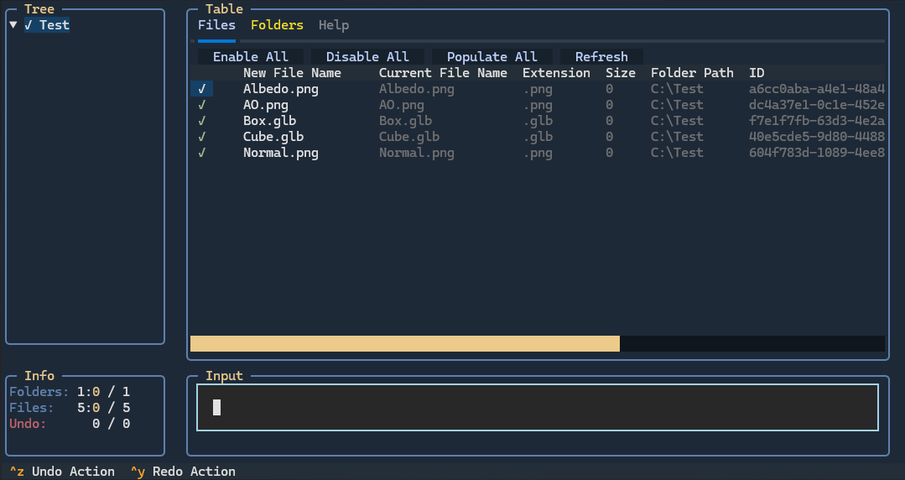

# Namnbyte

This is a command-line tool for batch renaming files/folders with powerful features like regex, case transformation, prefix/suffix additions, and more.

Built using **Python** and the **Textual** library, this tool offers a flexible and interactive way to manage and rename files/folders.

## Features
- Multiple Renaming Methods: Supports replace, regex-based, index-based renaming, and more.
- Batch Processing: Rename multiple files and folders at once.
- Preview & Apply: Changes are applied in a preview, allowing modifications and confirmation before finalizing.
- Lazy Loading: Dynamically loads files and folders as needed, improving efficiency when handling large directories.

## Disclaimer
Please note that both the program and the documentation are still a work in progress and may contain incomplete or inaccurate information.

---

## Installation

1. **Clone the Repository**:
   ```bash
   git clone https://github.com/DevFika/namnbyte.git
   cd namnbyte

2. **Install Dependencies**:
    ```bash
    pip install -r requirements.txt

3. **Usage**:
    ```bash
    python main.py path/to/your/folder

## Command Reference

| Command | Description | Usage | Example | Options |
| ------- | ----------- | ----- | ------- | ------- |
| **-add-separators** | Adds separators to the filenames. | `add-separators separator` | `add-separators _  →  fileText.txt → file_Text.txt` |  |
| **-add-timestamp** | Adds a timestamp to the filenames with a specified granularity and separator. You can choose from predefined granularities or use a custom format for the timestamp. | `add-timestamp granularity separator` | `add-timestamp day _  →  file.txt → file_2025-03-28.txt` | year: Adds the year (e.g., 2025), month: Adds the year and month (e.g., 202503), day: Adds the full date (e.g., 20250328), hour: Adds the date and hour (e.g., 20250328_15), minute: Adds the date and minute (e.g., 20250328_1530), second: Adds the full date and time with seconds (e.g., 20250328_153045), custom: A custom format using the strftime syntax (e.g., '%Y%m%d_%H%M') |
| **-case** | Changes the case of the text in filenames. You can choose from various styles. | `case style` | `case upper  →  file.txt → FILE.TXT` | upper: Converts text to uppercase., lower: Converts text to lowercase., snake: Converts text to snake_case., camel: Converts text to camelCase., pascal: Converts text to PascalCase., kebab: Converts text to kebab-case., title: Converts text to title case., flip: Flips the case of each letter., capitalize: Capitalizes the first letter of each word., dot: Converts text to dot.case., title-snake: Converts text to Title_Snake_Case. |
| **-clean** | Cleans the filenames by removing unnecessary characters. | `clean` | `clean  →  file_ name.txt → file_name.txt` |  |
| **-img-info-add** | Adds image metadata to the filenames. | `img-info-add` | `img-info-add  →  file.txt → file_imginfo.txt` |  |
| **-limit-length** | Limits the length of the filenames to a maximum number of characters. | `limit-length max` | `limit-length 10  →  this_is_a_long_filename.txt → this_is.txt` |  |
| **-normalize** | Normalize filenames by collapsing repeated spaces, underscores, dashes, and dots. | `normalize` | `normalize  →  file__test.txt → file_test.txt` |  |
| **-prefix** | Adds a prefix to the filenames. | `prefix text_` | `prefix new_  →  file.txt → new_file.txt` |  |
| **-remove** | Removes the given text from filenames. | `remove text1 text2 ...` | `remove temp_  →  temp_report.txt → report.txt` |  |
| **-remove-leading** | Removes leading text from filenames. | `remove-leading text` | `remove-leading draft_  →  draft_report.txt → report.txt` |  |
| **-remove-non-ascii** | Removes non-ASCII characters from filenames. | `remove-non-ascii` | `remove-non-ascii  →  file_éxample.txt → file_example.txt` |  |
| **-remove-numbers** | Removes all numbers from filenames. | `remove-numbers` | `remove-numbers  →  file123.txt → file.txt` |  |
| **-remove-repeating-connected** | Removes repeating connected words from filenames. | `remove-repeating-connected text1 text2 ...` | `remove-repeating-connected test  →  testtest.txt → test.txt` |  |
| **-remove-repeating-words** | Removes repeating words in filenames. | `remove-repeating-words` | `remove-repeating-words  →  file_report_report.txt → file_report.txt` |  |
| **-remove-trailing** | Removes trailing text from filenames. | `remove-trailing text` | `remove-trailing _draft  →  report_draft.txt → report.txt` |  |
| **-replace** | Replaces occurrences of `old_text` with `new_text`. | `replace old_text new_text` | `replace apple banana  →  file_apple.txt → file_banana.txt` |  |
| **-replace-ext** | Replaces the old extension with a new extension. | `replace-ext old_ext new_ext` | `replace-ext txt pdf  →  file.txt → file.pdf` |  |
| **-replace-index** | Replaces the text at a specific index, separated by a given separator. | `replace-index separator index new_text` | `replace-index _ 2 new_text  →  file_part1_part2.txt → file_part1_new_text.txt` |  |
| **-replace-regex** | Replaces occurrences of a pattern with a replacement using regex. | `replace-regex pattern replacement` | `replace-regex '\d' X  →  123_file.txt → XXX_file.txt` |  |
| **-replace-separator** | Replaces the current separator with a new one. | `replace-separator new_separator` | `replace-separator -  →  file_name.txt → file-name.txt` |  |
| **-reset** | Resets the filenames to their original state. | `reset` | `reset  →  file.txt → file_original.txt` |  |
| **-resolution-add** | Adds a resolution tag to the filenames. | `resolution-add type` | `resolution-add tag  →  file.png → file_2k.png` |  |
| **-resolution-remove** | Removes a resolution tag from the filenames. | `resolution-remove type` | `resolution-remove exact  →  file_600x100.png → file.png` |  |
| **-reverse** | Reverses the order of characters in filenames. | `reverse` | `reverse  →  file.txt → elif.txt` |  |
| **-suffix** | Adds a suffix to the filenames. | `suffix _text` | `suffix _new  →  file.txt → file_new.txt` |  |
| **-swap** | Swaps the occurrences of two words in filenames. | `swap word1 word2` | `swap apple banana  →  apple_banana.txt → banana_apple.txt` |  |
| **-zeros** | Adds or removes leading zeros in filenames. | `zeros add/remove num_zeros` | `zeros add 3  →  file1.txt → file001.txt` |  |
## Flag Reference

| Flag        | Description               | Usage               |
| ----------- | ------------------------- | ------------------- |
| **--apply** |  | `` |
| **--apply-all** |  | `` |
| **--date** |  | `` |
| **--disable-all** |  | `` |
| **--disable-ext** |  | `` |
| **--disable-pattern** |  | `` |
| **--disable-regex** |  | `` |
| **--enable-all** |  | `` |
| **--enable-ext** |  | `` |
| **--enable-pattern** |  | `` |
| **--enable-regex** |  | `` |
| **--ext** |  | `` |
| **--ignore-extension** |  | `` |
| **--prefix** |  | `` |
| **--preserve-caps** |  | `` |
| **--regex** |  | `` |
| **--reset-all** |  | `` |
| **--size** |  | `` |
| **--split-numbers** |  | `` |

## Keybindings

### General Bindings:
- **1**: Focus on Tree View
- **f1**: Focus on Tree View
- **2**: Focus on File Table
- **f2**: Focus on File Table
- **3**: Focus on Folder Table
- **f3**: Focus on Folder Table
- **4**: Focus on Input Field
- **f4**: Focus on Input Field
- **ctrl+z**: Undo Action
- **ctrl+y**: Redo Action
- **ctrl+q**: Quit

### Table Actions:
- **↻ (Reset)**: Reset the current folder/file name.
- **⏎ (Apply)**: Apply the new folder/file name (confirm change).
- **✓ (Enabled)**: Toggle the folder/file's enabled status.
- **Click on New Name**: Click on the folder/file name to manually edit it.

### Tree Bindings:
- **a**: Expand all
- **c**: Collapse all
- **x**: Disable all
- **e**: Enable all
- **f**: Toggle folder
- **right**: Expand selected
- **left**: Collapse selected
- **ctrl+right**: Expand selected + children
- **ctrl+left**: Collapse selected + children
- **ctrl+down**: Disable selected + children
- **ctrl+up**: Enable selected + children

### Edit Name Screen Bindings:
- **Enter**: Submit current input
- **escape**: Exit

### Command Line Bindings:
- **Enter**: Submit current command/input
- **Up**: Previous command (navigate command history)
- **Down**: Next command (navigate command history)

### Panel Resizing:
- **Click and Drag Separators**: Resize the panels by clicking and dragging the separator between them. This allows you to adjust the layout ratio according to your preferences.

    
## Contributing
Contributions are welcome! Please open an issue or submit a pull request.

## License
This project is licensed under the MIT License - see the LICENSE file for details.
